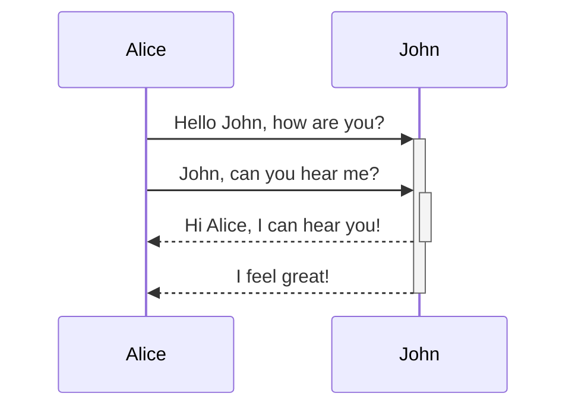

# Competition Overview
The competition is in the context of regression testing for test suites executing system tests of self-driving cars in simulation.
Regression testing involves test selection, prioritization, and minimization [^3].
For the competition, we focus on the former aspect - the test selection.

## Test Selection
*Test Selection* is the process of picking only the relevant test cases from the test suite for a particular change.
In the context of simulation-based testing for SDCs with long running test cases, we select test cases fulfilling certain constraints [^1][^2].
For the competition we set a time budget:
- *Time Budget*: A maximal amount of time is available to run the selected test cases.

```{text}
[ ][ ][ ][ ]      [x][ ][x][ ]
[ ][ ][ ][ ]  ->  [x][ ][ ][x]
[ ][ ][ ][ ]      [ ][x][ ][ ]
```
## Goal
The participants of the tool competition submit a test selector for simulation-based tests.
Specifically, the participants implement the predefined interfaces provide by the tool competition platform.

- *Time Budget*: A maximal amount of time is available to run the selected test cases.
- *Fault Detection*: TODO
- *Diversity*: TODO

## Competition Platform
tbd



## Competition Guidelines
There are no major limitations for the implementation of a test selection approach.
The competitors have only to implement the provided interfaces and ensure that their tool works inside a Docker container.

The organizers will evaluate the submitted tools on a virtual machine with the following specifications:

| HW/SW   | Requirement |
|---------|-------------|
| CPU     | TBD         |
| GPU     | TBD         |
| RAM     | TBD         |
| OS      | TBD         |
| Network | TBD         |


## Tool Submission
There are two ways to submit a tool:

## Open Source (Preferred)
We ask the competitors to submit their tool by opening a Pull Request to this reposotiry.
The tool, i.e., the implementation of the provided interfaces, should be in the ´tool´ directory.
The competition chairs will evaluate the submitted tools and in case of issues a discussion will happen in the Pull Request.

## Closed Source
In case of confidentiality reasons where the source code of the tool can not be disclosed.
The competitors must submit their tool (copy of their repository) per email:

```text
TO: birc@zhaw.ch
SUBJECT: [ICST'25 SDC Tool Competition] Submission <TOOL NAME>
```


## References
[^1]: C. Birchler, S. Khatiri, B. Bosshard, A. Gambi, S. Panichella, "Machine learning-based test selection for simulation-based testing of self-driving cars software," Empirical Software Engineering (EMSE) 28, 71 (2023). https://doi.org/10.1007/s10664-023-10286-y
[^2]: C. Birchler, N. Ganz, S. Khatiri, A. Gambi and S. Panichella, "Cost-effective Simulation-based Test Selection in Self-driving Cars Software with SDC-Scissor," International Conference on Software Analysis, Evolution and Reengineering (SANER), 2022. https://doi.org/10.1109/SANER53432.2022.00030.
[^3]: Yoo, Shin, and Mark Harman. "Regression testing minimization, selection and prioritization: a survey." Software testing, verification and reliability 22.2 (2012): 67-120.
