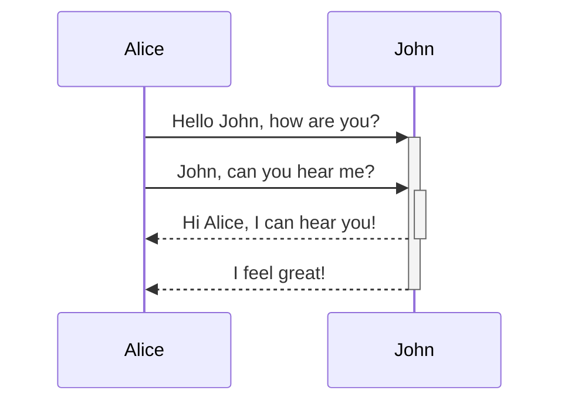

# Competition Overview
The competition is in the context of regression testing for test suites executing system tests of self-driving cars in simulation.
Regression testing involves test selection, prioritization, and minimization[Reference].
For the competition, we focus on the former aspect - the test selection.

## Test Selection
*Test Selection* is the process of picking only the relevant test cases from the test suite for a particular change.
In the context of simulation-based testing for SDCs with long running test cases, we select test cases fulfilling certain constraints[^1][^2]:
- *Time Budget*: TODO
- *Fault Detection*: TODO
- *Diversity*: TODO

```{text}
[ ][ ][ ][ ]      [x][ ][x][ ]
[ ][ ][ ][ ]  ->  [x][ ][ ][x]
[ ][ ][ ][ ]      [ ][x][ ][ ]
```
## Goal
The participants of the tool competition submit a test selector for simulation-based tests.
Specifically, the participants implement the predefined interfaces provide by the tool competition platform.

## Competition Platform
tbd



## Competition Guidelines
tbd

## Tool Submission
tbd

## References
[^1]: C. Birchler, S. Khatiri, B. Bosshard, A. Gambi, S. Panichella, "Machine learning-based test selection for simulation-based testing of self-driving cars software," Empirical Software Engineering (EMSE) 28, 71 (2023). https://doi.org/10.1007/s10664-023-10286-y

[^2]: C. Birchler, N. Ganz, S. Khatiri, A. Gambi and S. Panichella, "Cost-effective Simulation-based Test Selection in Self-driving Cars Software with SDC-Scissor," International Conference on Software Analysis, Evolution and Reengineering (SANER), 2022. https://doi.org/10.1109/SANER53432.2022.00030.
