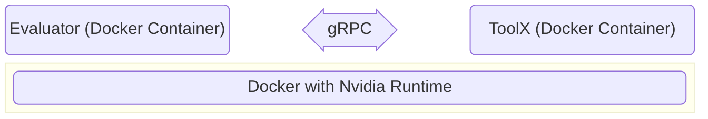
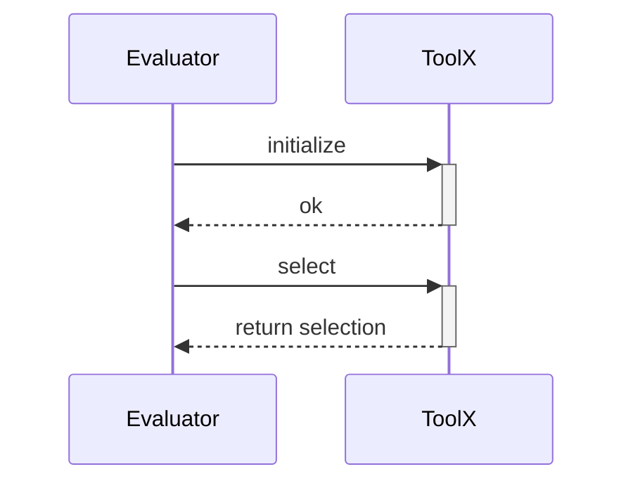

# Competition Overview
The competition is in the context of regression testing for test suites executing system tests of self-driving cars in simulation.
Regression testing involves test selection, prioritization, and minimization [^3].
For the competition, we focus on the first aspect - the test selection.

## Test Selection
*Test Selection* is the process of picking only the relevant test cases from the test suite for a particular change.
In the context of simulation-based testing for SDCs with long running test cases, we select test cases fulfilling certain constraints [^1][^2].

```text
 Test Suite        Selection
[ ][ ][ ][ ]      [x][ ][x][ ]
[ ][ ][ ][ ]  ->  [x][ ][ ][x]  -> Execution of the Selection  -> Results
[ ][ ][ ][ ]      [ ][x][ ][ ]
```
## Goal
The goal is to develop cost-effective novel test selection tools.
The participants of the tool competition submit a test selector for simulation-based tests of SDCs.
We consider a test **passing** when the car drives **within the lane** during the whole simulation scenario.
We consider a test **failing** when the car drives **off the lane** during the simulation.
When the car drives off the lane then the test execution immediately stops to lower the execution costs.

```text
            IN-LANE                                    OFF-LANE
     ||        |        ||                      ||        |        ||
     ||        |        ||                      ||        |        ||
     ||        |        ||                      ||        |        ||
     ||        |        ||                      ||        |        ||
     ||        |        ||                      ||        |        ||
     ||        |  xxxx  ||                      ||        |      xxxx
     ||        | O----O ||                      ||        |     O----O
     ||        | xxxxxx ||                      ||        |     xxxxxx
     ||        | xxxxxx ||                      ||        |     xxxxxx
     ||        | xxxxxx ||                      ||        |     xxxxxx
     ||        | xxxxxx ||                      ||        |     xxxxxx
     ||        | O----O ||                      ||        |     O----O
     ||        |  xxxx  ||                      ||        |      xxxx
     ||        |        ||                      ||        |        ||
     ||        |        ||                      ||        |        ||
     ||        |        ||                      ||        |        ||
     ||        |        ||                      ||        |        ||
     ||        |        ||                      ||        |        ||
     ||        |        ||                      ||        |        ||
     ||        |        ||                      ||        |        ||
     ||        |        ||                      ||        |        ||
     ||        |        ||                      ||        |        ||
```


## Competition Platform
The competition platform aims to provide the participant as much freedom as possible for their implementations.
The competitors can use any programming language they want.

To make the evaluation of the tools coherent, the competitors have to implement a gRPC [^4] interface specified in the `competition.proto` file.
The gRPC framework is language independent, i.e., there are various languages supported by gRPC.
The evaluator of the tools will invoke Remote Procedure Calls (RPC) which provide the tools the data for the evaluation.
Bewlow you see figures illustrating the overall set up.





### Test Case Definition
For the competition, we define a single test case as a sequence of road points.
When you look at the `competition.proto` file, you will find the following definitions:
```protobuf
...
message SDCTestCase {
  string testId = 1; // unique identifier
  repeated RoadPoint roadPoints = 2; // sequence of road points
}

message RoadPoint {
  int64 sequenceNumber = 1; // The order of the road points starting with 0. The car starts at the road point with sequenceNumber 0!
  float x = 2; // x-coordinate
  float y = 3; // y-coordinate
}
...
```
The road points are coordinates on a 2-dimensional Cartesian plane.
The simulation will interpolate the road points to shape the road.
> The more road point there are, the more accurate is the test case projected in the simulation environment as there are less variance due to the interpolation.

## Competition Guidelines
There are no major limitations for the implementation of a test selection approach.
The competitors have only to implement the provided interfaces (`competition.proto`) and ensure that their tool works inside a Docker container.

The participants have to generate first the interface stubs using the `protoc` compiler to generate the code based on the interface specification in the `competition.proto` file.

In `tools/sample_tool` is a sample implementation of a trivial test selector.
It starts a gRPC server and provides implementations of the interfaces.
Furthermore, the sample tool also provides a `Dockerfile` to run it inside a container.

Build and run the sample test selector tool:
```bash
cd tools/sample_tool
docker build -t my-selector-image .
docker run --rm --name my-selector-container -t -p 4545:4545 my-selector-image -p 4545
```

Build and run the evaluator tool that uses the sample dataset and performs an initial evaluation:
```bash
cd evaluator
docker build -t evaluator-image .
docker run --rm --name evaluator-container -t evaluator-image -u host.docker.internal:4545
```

All participants should ensure that the evaluator is able to provide an evaluation report to the console.
This is a clear indication the the gRPC interfaces are working properly, which is crucual for the competition's evaluation.


More information about gRPC you can find here: https://grpc.io/

## Evaluation
The organizers will use a dataset of test cases for the BeamNG.tech simulator.
Hence, the participants should consider to use reference test cases for the same simulator.
There are several test generators available for the BeamNG simulator from the **SBFT@ICSE** workshop series [^5][^6][^7]. 

The evaluation will be based on BeamNG's built-in autopilot with a *risk factor (RF)* of 1.5 and a *maximum speed* of 120km/h.
We will use an OOB threashold (percentage the SDC is allowed to drive off the lane) of 50% but we might experiment with smaller values as well.

The tools will be evaluated on the following metrics (potential new metrics will be announced in the discussion forum):
- *Fault Detection*: The number of test failures we observe when running the selected test cases.
- *Diversity*: The more diverse the test cases are the better. We do not want to run almost the same test cases.

> For a clear description of the evaluation metrics, refer to the `MetricEvaluator` class of the evaluator!


**Note:** The organizers will evaluate the submitted tools on a virtual machine with the following specifications:

| **HW/SW** | **Requirement** |
|-----------|-----------------|
| CPU       | 8 vCPUs         |
| GPU       | Nvidia Tesla T4 |
| CUDA      | TBA             |
| RAM       | 16 GB           |
| OS        | Ubuntu/Linux    |
| Network   | no Internet     |

The competitors have to make sure that their tools will work on the abovementioned specifications.


## Tool Submission
There are two ways to submit a tool:

### Open Source (preferred)
We ask the competitors to submit their tool by opening a Pull Request to this reposotiry.
The tool, i.e., the implementation of the provided interfaces, should be in the ´tool´ directory.
Furthermore, the competitors shall include a `LICENSE.md` and the link to a pre-built docker image of their tools.

The competition chairs will evaluate the submitted tools and in case of issues a discussion will happen in the Pull Request.

### Closed Source
In case of confidentiality reasons where the source code of the tool can not be disclosed, the competitors must submit their tool (copy of their repository) per email:

```text
TO: birc@zhaw.ch
SUBJECT: [ICST'25 SDC Tool Competition] Submission <TOOL NAME>
```


## References
[^1]: C. Birchler, S. Khatiri, B. Bosshard, A. Gambi, S. Panichella, "Machine learning-based test selection for simulation-based testing of self-driving cars software," Empirical Software Engineering (EMSE) 28, 71 (2023). https://doi.org/10.1007/s10664-023-10286-y
[^2]: C. Birchler, N. Ganz, S. Khatiri, A. Gambi and S. Panichella, "Cost-effective Simulation-based Test Selection in Self-driving Cars Software with SDC-Scissor," International Conference on Software Analysis, Evolution and Reengineering (SANER), 2022. https://doi.org/10.1109/SANER53432.2022.00030.
[^3]: Yoo, Shin, and Mark Harman. "Regression testing minimization, selection and prioritization: a survey." Software testing, verification and reliability 22.2 (2012): 67-120.
[^4]: https://grpc.io/
[^5]: M. Biagiola, S. Klikovits, J. Peltomäki and V. Riccio, "SBFT Tool Competition 2023 - Cyber-Physical Systems Track," 2023 IEEE/ACM International Workshop on Search-Based and Fuzz Testing (SBFT), Melbourne, Australia, 2023, pp. 45-48, doi: 10.1109/SBFT59156.2023.00010. keywords: {Conferences;Organizations;Cyber-physical systems;Fuzzing;Autonomous vehicles;Autonomous Vehicles;Search-Based Software Testing},
[^6]: Alessio Gambi, Gunel Jahangirova, Vincenzo Riccio, and Fiorella Zampetti. 2023. SBST tool competition 2022. In Proceedings of the 15th Workshop on Search-Based Software Testing (SBST '22). Association for Computing Machinery, New York, NY, USA, 25–32. https://doi.org/10.1145/3526072.3527538
[^7]: S. Panichella, A. Gambi, F. Zampetti and V. Riccio, "SBST Tool Competition 2021," 2021 IEEE/ACM 14th International Workshop on Search-Based Software Testing (SBST), Madrid, Spain, 2021, pp. 20-27, doi: 10.1109/SBST52555.2021.00011. keywords: {Software testing;Java;System testing;Statistical analysis;Organizations;Tools;Cyber-physical systems;Competition;Tools;Unit Testing;Simulation based Testing;Java;Self driving car software;Automated Test Generation},


